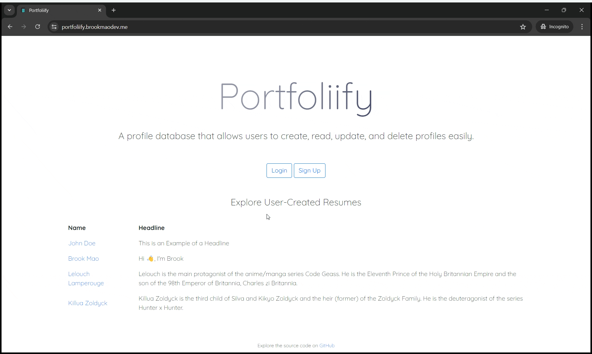

# Portfoliify

Portfoliify is a profile database that allows users to create, read, update, and delete profiles easily.



[Try it out here!](https://portfoliify.brookmaodev.me/)  
If you don't want to sign up and create a new account, you can login with a premade user account:  
Email: johndoe@example.com  
Password: password123

## Technologies Used

- **Bootstrap** and **jQuery** for the frontend
- **Apache** + **PHP** for server-side processing
- **MySQL** database running on filess.io
- **Docker** for containerization, deployed to **Azure Container Apps** using a serverless architecture

## How to Build

Follow these steps to build and run Portfoliify locally:

1. Fork the repository by clicking the "Fork" button at the top right of the repository page on GitHub.
2. Clone your forked repository using the following command, replacing `<your-username>` with your GitHub username:
   ```bash
   git clone https://github.com/<your-username>/Portfoliify.git
   ```
3. Install Docker Desktop from [here](https://www.docker.com/products/docker-desktop).
4. Open a terminal in the repository directory and run the following command to build and start the containers:
   ```bash
   docker-compose -f "docker-compose.yml" up -d --build
   ```
5. Open your web browser and go to [http://localhost](http://localhost) to access Portfoliify.

## Image Attributions

- Favicon image used from [icon-icons.com](https://icon-icons.com/icon/database/102857)
